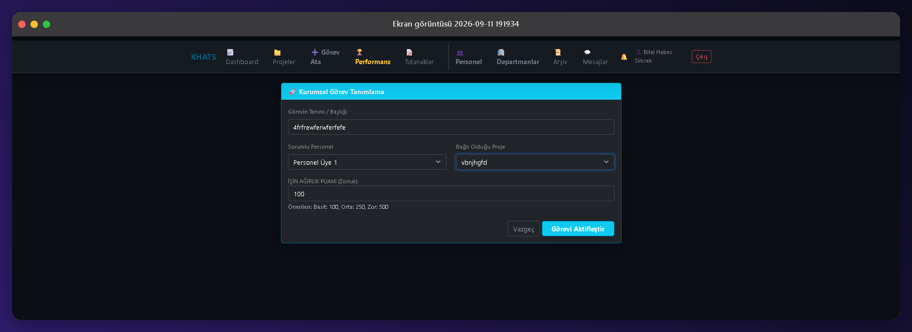
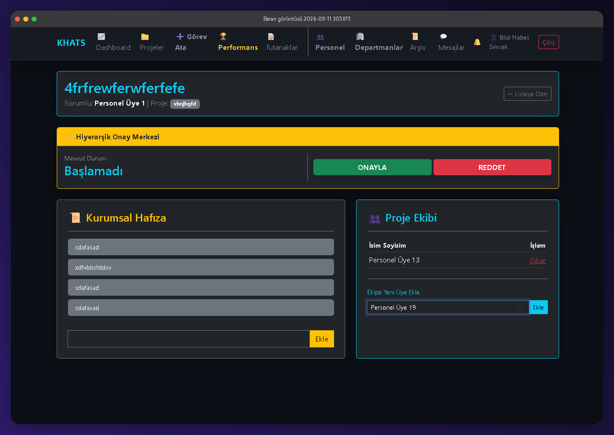
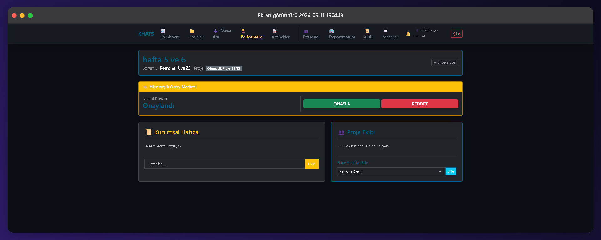
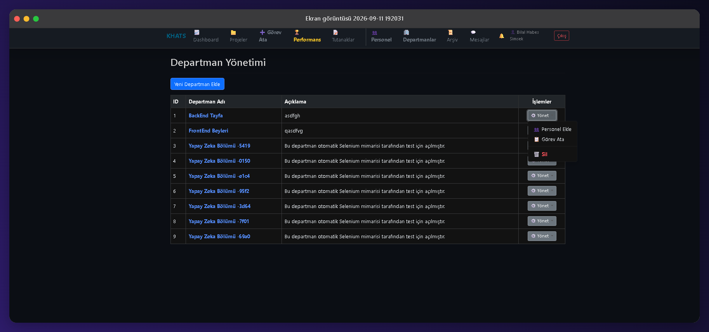

# 🏢 KHATS - Kurumsal Hafıza ve Takip Sistemi


**KHATS (Kurumsal Hafıza Takip Sistemi)**, kurumsal organizasyonlardaki bilgi kaybını önlemek, proje ve görev yönetimini tek merkezden yürütmek, anlık iletişimi sağlamak ve personel performansını somut metriklerle analiz etmek amacıyla geliştirilmiş kurumsal bir **ASP.NET Core 8.0 MVC** platformudur.

---

## ✨ Temel Özellikler

* **⚡ Gerçek Zamanlı İletişim (SignalR):** Çalışanlar arasında WebSocket tabanlı uçtan uca canlı mesajlaşma, dosya/belge aktarımı ve anlık bildirim kanalı.
* **🔔 Dinamik Bildirim & Oturum Yönetimi:** Yeni görev tanımlandığında veya proje atandığında tetiklenen Toast bildirimleri ve yetki iptalinde istemci tarafını anında yönlendiren oturum sonlandırma sinyali (`OturumuKapat`).
* **⚖️ Hiyerarşik Görev Akışı:** Personelin işi tamamlayıp onaya göndermesi, yöneticinin görevi onaylaması veya revize notu düşerek reddetmesi süreçlerini kapsayan iki aşamalı karar mekanizması[cite: 7].
* **📜 Kurumsal Hafıza & Notlandırma:** Görev bazlı kronolojik revize geçmişi ve not akışı sayesinde projelerin karar adımlarının kayıt altına alınması[cite: 7].
* **📊 Ağırlık Puanlı Verimlilik Raporlaması:** Görev zorluk puanları (100, 250, 500) üzerinden çalışanların tamamladığı işlere göre haftalık/aylık performans hesaplama ve **Excel (CSV)** çıktısı alma[cite: 7].
* **📝 Toplantı Tutanakları & Arşiv:** Kurumsal toplantı kararlarının dijitalleştirilmesi, imzalı PDF/belge yüklemeleri ve tamamlanan/iptal edilen projelerin saklandığı güvenli arşiv alanı[cite: 7].
* **🤖 Uçtan Uca E2E Otomasyon Testleri:** `Khats.Testler` projesi altında xUnit ve Selenium WebDriver ile yazılmış 4 ana senaryodan oluşan otomatik tarayıcı testleri[cite: 7].

---

## 🛠️ Teknoloji Yığını & Mimari

* **Framework:** ASP.NET Core 8.0 MVC[cite: 7]
* **Veritabanı & ORM:** Microsoft SQL Server, Entity Framework Core (Code-First)[cite: 7]
* **Canlı Veri İletişimi:** Microsoft SignalR Hubs[cite: 7]
* **Arayüz:** HTML5, CSS3, Bootstrap 5 (Dark Theme), JavaScript, jQuery, AJAX[cite: 7]
* **Test Altyapısı:** xUnit, Selenium WebDriver, ChromeDriver[cite: 7]
* **Yetkilendirme:** Cookie Authentication tabanlı Rol Bazlı Erişim Kontrolü (RBAC)[cite: 7]

---

## 👥 Kullanıcı Rolleri ve Yetki Matrisi

Sistem 3 temel rol hiyerarşisine göre çalışır[cite: 7]:

| Yetki / Modül | Admin (Sistem Yöneticisi) | Görev Sorumlusu (Yönetici) | Saha Personeli |
| :--- | :---: | :---: | :---: |
| **Özet Paneli (Dashboard)** | Şirket Geneli[cite: 7] | Sorumlu Olunan Projeler[cite: 7] | Kendi Görevleri[cite: 7] |
| **Proje & Ekip Yönetimi** | Tam Yetki[cite: 7] | Sorumlu Olduğu Projeler[cite: 7] | ❌ |
| **Görev Atama & Puanlama** | Tam Yetki[cite: 7] | Ekibine Görev Atama[cite: 7] | ❌ |
| **Hiyerarşik Onay/Ret** | Tam Yetki[cite: 7] | Yönetici Onayı[cite: 7] | Onaya Gönderme[cite: 7] |
| **Performans & CSV Raporu** | Tam Yetki[cite: 7] | Ekip Raporları[cite: 7] | ❌ |
| **Departman & Personel** | Tam Yetki[cite: 7] | ❌ | ❌ |
| **Canlı Sohbet & Arşiv** | Aktif[cite: 7] | Aktif[cite: 7] | Aktif[cite: 7] |

---

## 🧪 Otomasyon Testleri (Selenium WebDriver)

`Khats.Testler/UnitTest1.cs` dosyası üzerinden yürütülen ana test senaryoları[cite: 7]:

1. **Uçtan Uca Modül Doğrulaması:** 9 farklı sistem rotasının kesintisiz yüklendiğini denetler[cite: 7].
2. **Çift Pencereli SignalR Testi:** İki farklı ChromeDriver örneği açarak kullanıcılar arasında anlık mesaj iletimini doğrular[cite: 7].
3. **Proje & Görev Döngüsü Testi:** Dinamik proje kaydı oluşturup ilgili projeye ağırlık puanlı görev bağlama akışını simüle eder[cite: 7].
4. **Yönetim Akışı Testi:** Otomatik departman açma, personel tanımlama ve personel yetkisini sonlandırıp erişim kontrolünü doğrulama sürecini yürütür[cite: 7].

---

## 📸 Ekran Görüntüleri

### 1. Rol Tabanlı Yetkilendirme (RBAC) & Dashboard

| Sistem Yöneticisi (Admin) Paneli | Saha Personeli Paneli |
| :---: | :---: |
|  |  |
| *Tüm departman, proje, tutanak ve personel verilerini kapsayan tam yetkili panel.* | *Yalnızca ilgili personele atanan işleri barındıran kısıtlı görünüm.* |

---

### 2. Canlı İletişim (SignalR) & Görev Tanımlama

| Gerçek Zamanlı Sohbet & Toast Bildirimleri | Ağırlık Puanlı Görev Atama |
| :---: | :---: |
|  |  |
| *WebSocket tabanlı uçtan uca anlık mesajlaşma ve sistem içi olay bildirimleri.* | *Zorluk derecesine (100, 250, 500) göre personele iş atama penceresi.* |

---

### 3. Hiyerarşik Onay & Kurumsal Hafıza

| Aktif Görev Takibi & Ekip Yönetimi | Onay Süreci & Karar Geçmişi |
| :---: | :---: |
|  |  |
| *Görev geçmişine dair revize notları ve projeye bağlı dinamik ekip üyeleri.* | *İki kademeli (Personel onaya sunar -> Yönetici onaylar/reddeder) onay mekanizması.* |

---

### 4. Departman Yönetimi & Kurumsal Arşiv

| Departman İşlem Merkezi | Kurumsal Hafıza Arşivi |
| :---: | :---: |
|  |  |
| *Departman bazlı hızlı personel ekleme, görev atama ve silme aksiyonları.* | *İptal edilen veya tamamlanan proje ve görevlerin kayıt altına alındığı arşiv.* |


---

## 🚀 Kurulum ve Çalıştırma

Projeyi yerel geliştirme ortamınızda çalıştırmak için:

1. Depoyu klonlayın:
   ```bash
   git clone [https://github.com/KullaniciAdin/Kurumsal-Hafiza-Takip-Sistemi.git](https://github.com/KullaniciAdin/Kurumsal-Hafiza-Takip-Sistemi.git)
   cd Kurumsal-Hafiza-Takip-Sistemi
